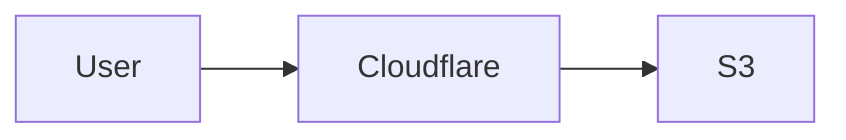

# eiler.dk — Personal Blog

Personal blog for eiler.dk. Articles cover tech, enterprise AI, product development with AI, platform and architecture. Hosted as a fully static site on AWS S3 + Cloudflare. No database, no server-side runtime.

All article content is written by Claude.

---

## Tech Stack

| Concern | Tool |
|---|---|
| Framework | Astro |
| Styling | Tailwind CSS + `@tailwindcss/typography` |
| Markdown | Astro Content Collections (remark/rehype pipeline) |
| Diagrams | `rehype-mermaid` (build-time SVG via `mermaid-isomorphic`) |
| Syntax highlighting | Shiki (Astro default) |
| Search | Pagefind (post-build, fully static) |
| Build output | Static HTML/CSS/JS (`output: 'static'`) |
| Hosting | AWS S3 (static website) + Cloudflare (CDN + HTTPS) |
| Deploy | GitHub Actions → S3 sync on push to `main` |

---

## Markdown Pipeline

### Remark plugins (Markdown AST)

| Plugin | Purpose |
|---|---|
| `remark-gfm` | Tables, strikethrough, task lists, autolinks |
| `remark-smartypants` | Smart quotes, em-dashes, ellipsis (Claude authors all content) |
| `remark-unwrap-images` | Removes `<p>` wrapper around standalone images and SVGs |
| `reading-time` | Estimated reading time — injected as article metadata |

### Rehype plugins (HTML AST)

| Plugin | Purpose |
|---|---|
| `rehype-mermaid` | Renders mermaid code blocks to inline SVG at build time |
| `rehype-slug` | Adds `id` attributes to all headings |
| `rehype-autolink-headings` | Adds clickable `#` anchor links to headings |
| `rehype-external-links` | Adds `target="_blank" rel="noopener noreferrer"` to external links |

### Astro integrations

| Package | Purpose |
|---|---|
| `@astrojs/tailwind` | Tailwind CSS integration |
| `@astrojs/sitemap` | Generates `sitemap.xml` at build time |
| `@astrojs/rss` | RSS feed generation |

### Config in `astro.config.mjs`

```js
import { defineConfig } from 'astro/config';
import tailwind from '@astrojs/tailwind';
import sitemap from '@astrojs/sitemap';
import rehypeMermaid from 'rehype-mermaid';
import rehypeSlug from 'rehype-slug';
import rehypeAutolinkHeadings from 'rehype-autolink-headings';
import rehypeExternalLinks from 'rehype-external-links';
import remarkGfm from 'remark-gfm';
import remarkSmartypants from 'remark-smartypants';
import remarkUnwrapImages from 'remark-unwrap-images';

export default defineConfig({
  site: 'https://eiler.dk',
  integrations: [tailwind(), sitemap()],
  markdown: {
    remarkPlugins: [remarkGfm, remarkSmartypants, remarkUnwrapImages],
    rehypePlugins: [
      rehypeMermaid,
      rehypeSlug,
      [rehypeAutolinkHeadings, { behavior: 'wrap' }],
      [rehypeExternalLinks, { target: '_blank', rel: ['noopener', 'noreferrer'] }],
    ],
  },
});
```

---

## Project Structure

```
src/
  content/
    blog/           ← .md article files (one file per article)
    config.ts       ← Zod schema for content collections
  components/       ← Astro components
  layouts/
    Base.astro      ← HTML shell, head, meta, SEO tags
    Article.astro   ← Article page layout
  pages/
    index.astro     ← Article listing, most recent first
    blog/
      [slug].astro  ← Individual article page
    rss.xml.ts      ← RSS feed
    llm.txt.ts      ← LLM-readable site index
    search.astro    ← Search fallback page
    about.astro     ← About page
  styles/
    global.css
public/             ← Static assets (favicon, og image)
pagefind/           ← Generated by Pagefind post-build (not committed)
.github/
  workflows/
    deploy.yml      ← CI/CD: build + deploy on push to main
    build-check.yml ← CI: build validation on pull requests
astro.config.mjs
tailwind.config.mjs
tsconfig.json
package.json
```

---

## Content Model

Articles are `.md` files in `src/content/blog/`. The collection schema is defined in `src/content/config.ts` using Zod.

### Article frontmatter

```yaml
---
title: "Article Title"
description: "One or two sentence summary."
date: 2026-02-25
tags: ["ai", "architecture", "platform"]
draft: false
---
```

### Schema fields

| Field | Type | Required | Notes |
|---|---|---|---|
| `title` | string | yes | |
| `description` | string | yes | Used in listing cards and meta tags |
| `date` | date | yes | ISO 8601 |
| `tags` | string[] | yes | Lowercase, hyphenated e.g. `enterprise-ai` |
| `draft` | boolean | no | Defaults to false. Excluded from production builds |

### Querying articles

```ts
const articles = await getCollection('blog', ({ data }) =>
  import.meta.env.PROD ? !data.draft : true
);

// Sort by date descending
articles.sort((a, b) => b.data.date.valueOf() - a.data.date.valueOf());
```

### Reading time

`reading-time` is called in `[slug].astro` and `index.astro` against `article.body`. Displayed on both the article listing and the article page.

---

## Diagrams

Mermaid diagrams are written as fenced code blocks in `.md` files and rendered to inline SVG at build time. No client-side JS required for diagrams.

````md

````

**Supported diagram types:** flowcharts, sequence diagrams, class diagrams, state diagrams, ER diagrams, Gantt charts, mindmaps, timelines, quadrant charts.

Additional diagram formats (PlantUML, Graphviz) can be added to the rehype pipeline later if needed.

---

## Search

Pagefind runs as a post-build step and indexes the `dist/` output. The index is static files served from S3 alongside the rest of the site.

**Build script in `package.json`:**

```json
{
  "scripts": {
    "build": "astro build && pagefind --site dist"
  }
}
```

A `/search` page uses the Pagefind UI or the Pagefind JS API. The search index files are committed to `dist/` only — not to source.

---

## SEO

Handled in `Base.astro` — no extra package required.

- `<meta name="description">` from frontmatter `description`
- Open Graph: `og:title`, `og:description`, `og:url`, `og:type`
- Canonical URL via `Astro.url`
- JSON-LD `Article` structured data on article pages
- `sitemap.xml` via `@astrojs/sitemap`
- RSS feed at `/rss.xml` via `@astrojs/rss`

---

## Routing & URLs

| Route | File | Description |
|---|---|---|
| `/` | `pages/index.astro` | Homepage — featured article + article grid |
| `/blog/[slug]` | `pages/blog/[slug].astro` | Individual article |
| `/about` | `pages/about.astro` | About page |
| `/search` | `pages/search.astro` | Search fallback (direct URL access) |
| `/rss.xml` | `pages/rss.xml.ts` | RSS feed |
| `/sitemap-index.xml` | Generated by `@astrojs/sitemap` | Sitemap |
| `/llm.txt` | `pages/llm.txt.ts` | LLM-readable site index, generated at build time |

Slugs are derived from the `.md` filename automatically by Astro.

There is no top navigation menu. The header contains only the site name and a search icon. Search slides down inline from the header — it is the only Astro island component on the site.

---

## Build & Deploy

### Local build

```bash
npm run build
# Runs: astro build && pagefind --site dist
```

### CI/CD — GitHub Actions

Deployment is fully automated via GitHub Actions. No manual deploys.

| Event | Workflow | Action |
|---|---|---|
| Push to `main` | `deploy.yml` | Build + deploy to S3 |
| Pull request | `build-check.yml` | Build only — validates nothing is broken |

### `deploy.yml`

```yaml
name: Deploy

on:
  push:
    branches: [main]

permissions:
  id-token: write   # Required for OIDC
  contents: read

jobs:
  deploy:
    runs-on: ubuntu-latest
    steps:
      - uses: actions/checkout@v4

      - uses: actions/setup-node@v4
        with:
          node-version: 20
          cache: npm

      - run: npm ci
      - run: npx playwright install chromium --with-deps
      - run: npm run build

      - uses: aws-actions/configure-aws-credentials@v4
        with:
          role-to-assume: ${{ secrets.AWS_ROLE_ARN }}
          aws-region: eu-north-1

      - run: aws s3 sync dist/ s3://${{ secrets.S3_BUCKET }} --delete
```

### `build-check.yml`

```yaml
name: Build Check

on:
  pull_request:
    branches: [main]

jobs:
  build:
    runs-on: ubuntu-latest
    steps:
      - uses: actions/checkout@v4

      - uses: actions/setup-node@v4
        with:
          node-version: 20
          cache: npm

      - run: npm ci
      - run: npm run build
```

### AWS authentication — OIDC

GitHub Actions authenticates to AWS via OpenID Connect (OIDC). No long-lived credentials are stored in GitHub Secrets.

**Required GitHub Secrets:**

| Secret | Value |
|---|---|
| `AWS_ROLE_ARN` | ARN of the IAM role GitHub Actions assumes |
| `S3_BUCKET` | S3 bucket name (`www.eiler.dk`) |

**AWS setup required:**
1. Create an IAM OIDC identity provider for `token.actions.githubusercontent.com`
2. Create an IAM role with a trust policy scoped to this repository
3. Attach a policy granting `s3:PutObject`, `s3:DeleteObject`, `s3:ListBucket`

### S3 bucket configuration

- Static website hosting enabled, index document: `index.html`
- Bucket policy: public `s3:GetObject` for all
- Region: `eu-north-1`

### Cloudflare configuration

- `www.eiler.dk` CNAME → `www.eiler.dk.s3-website.eu-north-1.amazonaws.com`
- Proxy enabled (orange cloud), SSL mode: Flexible
- Cloudflare handles HTTPS and CDN — no CloudFront

---

## Design System

Full UI specification, wireframes and component inventory: [`docs/design.md`](docs/design.md)

### Philosophy

The visual language is inspired by Swiss International Typographic Style — Josef Müller-Brockmann. Typography is the graphic element. No decorative imagery, no coloured backgrounds, no gradients. The page is white, the ink is near-black. Diagrams (mermaid) are the only illustrations, and they should feel structural rather than decorative.

Content is arranged on a strict grid. Spacing is mathematical. Hierarchy is achieved through type size and weight contrast — not colour, not ornamentation.

### Typefaces

See [`docs/fonts.md`](docs/fonts.md) for full setup instructions.

| Role | Font | Weights used | Source |
|---|---|---|---|
| Display / Headings | Sprat Condensed | Thin (100), Light (300) | Self-hosted — Collletttivo / GitHub |
| Body / UI | Hanken Grotesk Variable | Light (300), Regular (400) | npm: `@fontsource-variable/hanken-grotesk` |

```css
:root {
  --font-display: 'Sprat', serif;
  --font-body:    'Hanken Grotesk Variable', sans-serif;
}
```

### Type scale

| Role | Size | Font | Weight | Line height |
|---|---|---|---|---|
| Display XL | 3.5rem (56px) | Sprat Condensed | 300 | 1.1 |
| Display L | 2.5rem (40px) | Sprat Condensed | 300 | 1.15 |
| Display M | 1.75rem (28px) | Sprat Condensed | 300 | 1.2 |
| Display S | 1.25rem (20px) | Sprat Condensed | 300 | 1.3 |
| Body | 1rem (16px) | Hanken Grotesk | 300 | 1.6 |
| UI / label | 0.75rem (12px) | Hanken Grotesk | 400 | 1.5 |
| Small / meta | 0.75rem (12px) | Hanken Grotesk | 300 | 1.5 |

### Typographic rules

- Headings and article titles use sentence case: only the first word and proper nouns/acronyms are capitalised — never title case (e.g. "The platform paradox", not "The Platform Paradox")
- Headings are always Sprat Condensed, mixed case — never all-caps
- Italic (`font-style: italic`) on Sprat is used sparingly and decoratively inside display text via `<em>`
- UPPERCASE is reserved strictly for UI chrome: navigation, buttons, eyebrow labels — never for headings
- Hierarchy is achieved through size contrast, not weight contrast — bold is almost never used
- Body text is Hanken Grotesk Light (300); UI labels and nav use Regular (400)
- Letter spacing: zero on all Sprat headings; slight positive tracking (0.05em) on uppercase UI labels only
- Max line width for body text: 65–70 characters (~680px) — never full-width prose

### Colour palette

| Token | Value | Use |
|---|---|---|
| Background | `#ffffff` | Page background — pure white |
| Primary text | `#0d0d0d` | Body copy, headings |
| Secondary text | `#555555` | Dates, reading time, metadata, captions |
| Accent | `#cc0000` | Links, hover states, active tag indicators only |
| Rule / border | `#e0e0e0` | Dividers, horizontal rules — no filled backgrounds |

Rules:
- No coloured backgrounds anywhere — sections are separated by whitespace and rules, not colour fills
- The accent (`#cc0000`) is used only for interactive text elements: links, hover states, active states
- No accent on backgrounds, borders, or decorative elements
- This palette is intentionally monochrome with a single classical red — consistent with Swiss print tradition

### Grid & spacing

- Base unit: `0.25rem` (4px)
- Content max-width: `720px` for article body
- Page max-width: `1100px` for layout shell
- Generous whitespace between sections — spacing carries as much weight as the type

---

## Development Workflow

### Prerequisites

- Node.js 20 (LTS)
- npm 10+

### Scripts

```json
{
  "scripts": {
    "dev":     "astro dev",
    "build":   "astro build && pagefind --site dist",
    "preview": "astro preview",
    "check":   "astro check"
  }
}
```

- `dev` — local dev server at `http://localhost:4321`, hot-reloading
- `build` — production build + Pagefind index generation
- `preview` — serves the `dist/` output locally to verify the build
- `check` — Astro TypeScript type-checking; run before pushing

### Review before pushing

All changes must be reviewed locally before being committed and pushed to GitHub. The workflow is:

1. Make changes
2. Run `npm run dev` and verify the result in the browser
3. Get explicit approval from the user
4. Only then commit and push to GitHub

Never push changes without the user having reviewed and approved them first.

### `.gitignore`

```
node_modules/
dist/
.astro/
.env
.env.*
```

The Pagefind index is generated into `dist/` at build time and is not committed to source.

---

## Syntax Highlighting

Shiki is Astro's default highlighter. Theme: `github-light` — consistent with the near-monochrome design system (no coloured backgrounds, subtle token colours). Configured in `astro.config.mjs`:

```js
markdown: {
  shikiConfig: {
    theme: 'github-light',
  },
}
```

Code blocks get a 1px border (`#e0e0e0`) via the `@tailwindcss/typography` overrides. No coloured backgrounds.

---

## Static Files

### `robots.txt`

Lives at `public/robots.txt`. Allow all crawlers, reference both sitemap and llm.txt:

```
User-agent: *
Allow: /

Sitemap: https://eiler.dk/sitemap-index.xml
```

### 404 page

`src/pages/404.astro` — uses the standard `Base.astro` layout. Simple message in Sprat Light, back link to `/`.

S3 error document must be set to `404.html` in the bucket static website hosting configuration (alongside `index.html` as the index document).

### `og:image`

The site uses no images. `og:image` is intentionally omitted from Open Graph meta tags — the title and description are sufficient. If a default OG image is added in future, it should be a text-based graphic consistent with the design system.

---

## Article Authoring

See [`docs/authoring.md`](docs/authoring.md) — to be completed after the first build.

---

## Key Conventions

- Article titles and all headings use sentence case — only the first word and proper nouns/acronyms are capitalised (e.g. "The platform paradox", not "The Platform Paradox")
- All articles are written by Claude as `.md` files
- No MDX in v1 — plain Markdown only
- No client-side JavaScript except Pagefind's search bundle and the search island
- Tags are lowercase and hyphenated: `enterprise-ai`, `platform`, `product-development`
- Drafts are excluded from production builds via `draft: true` in frontmatter
- Diagrams are always mermaid fenced code blocks — never external images
- No images anywhere on the site — typography and diagrams only

---

## Not In Scope (v1)

- Comments (consider giscus via GitHub Discussions for v2)
- Authentication or dynamic routes
- Image optimization pipeline
- Tag listing pages (consider for v2)
- Pagination (consider for v2 when article count grows)
- Dark mode
