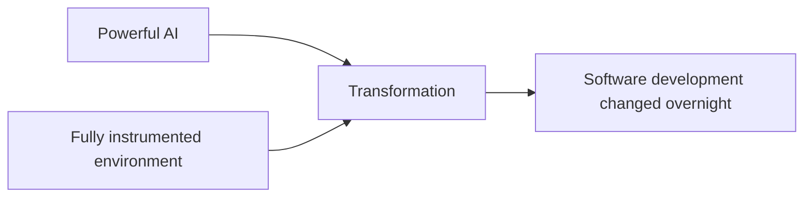
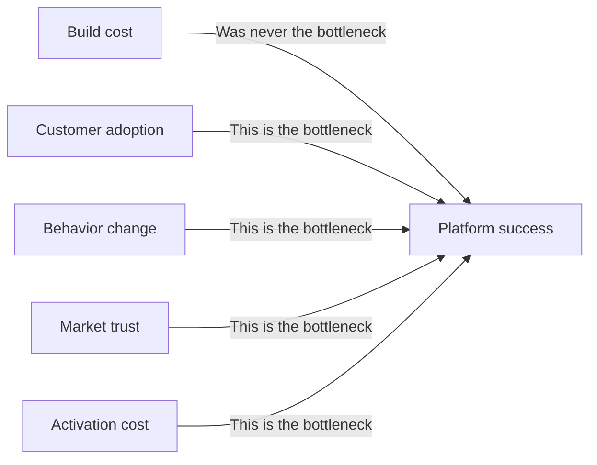

AI is genuinely transformative. Claude Code has changed software development in ways that will compound for years. Any company can now build sophisticated digital products with a fraction of the people and time it previously required. That is not hype. That is real.

But here is the uncomfortable truth that the AI discourse is almost entirely avoiding: **for most enterprises, building was never the bottleneck.**

## The speed of change in tech was not an accident

Claude Code did not just make development cheaper. It changed the nature of software development almost overnight. What previously required large engineering teams, long planning cycles, and significant capital can now be executed by a fraction of the people in a fraction of the time. The pace of that shift has been genuinely unprecedented.

But it is worth asking why it happened so fast. The answer is not simply that AI is powerful. It is that software development was a uniquely prepared environment.

Code has immediate and unambiguous feedback — it runs or it does not. The entire working environment is digital by definition. The tools are fully accessible: terminal, files, APIs, version control, test runners. Every action produces a measurable result. And decades of documented human knowledge were available to train on.

Claude Code is not magic. It is a capable agent operating in an environment that was **already fully instrumented for automation**. The prerequisites were completely in place. When a powerful AI met a perfectly legible environment, the impact was instant and dramatic.

> *The speed of transformation in tech was not just about the quality of the AI. It was about the readiness of the environment.*

## The cost structure nobody talks about

Now consider what this means for the rest of the enterprise world.

Imagine a large company deciding whether to build a new business platform. The project is scoped at €50 million. AI collapses that cost to €10 million. Or €1 million. For the sake of argument — zero.

Does the platform succeed?

Not automatically. Not even probably. Because the build cost was never the primary cost of success.

To build a successful business platform, you still need:

- Customers who adopt it
- Users who engage with it
- Partners who integrate with it
- Markets that trust it
- Organizations that change behavior for it

The cost of winning the market has always been — and remains — significantly larger than the cost of building the product. In most enterprise contexts I have been part of, the ratio is not close. Development is a fraction of the total cost of success. The rest is commercial, organizational, and human.

Cheaper code does not change any of that.

## The "fail fast" fallacy outside tech

The AI discourse also imports assumptions from Silicon Valley that are simply category errors when applied to most of the global economy.

Speed-to-learning. Rapid iteration. Fail fast.

These principles assume that the marginal cost of experimentation approaches zero. In software, that is true. In most of the real economy, it is not.

A production company building a factory at €500 million does not think in sprints. Their binding constraints are capacity planning, demand forecasting over a 10-year horizon, and capital allocation confidence. A pharmaceutical company running a clinical trial cannot pivot after two weeks of data. A logistics network cannot be A/B tested.

For these companies — which represent most of global GDP — faster software iteration is genuinely irrelevant to their core strategic challenges. The minimum viable experiment is not a feature flag. It is a plant, a regulatory submission, or a decade-long distribution partnership.

## The prerequisites problem

Here is what the speed of change in tech actually teaches us, applied honestly to the rest of the enterprise world.

Tech did not transform because AI arrived. It transformed because AI arrived into an environment that was completely ready for it. The prerequisites — digitized workflows, accessible tools, immediate feedback, legible data — were already fully in place.

Most enterprises are not in that position. Their workflows are fragmented or still partially analog. Their data is siloed or unstructured. Their processes do not produce fast, measurable feedback. The environment is not yet legible to AI in the way a codebase is.

This means the question for most enterprises is not "how do we use AI." It is a more fundamental one: **are our prerequisites in place?**

That means:

- Digitizing workflows that are still fragmented or analog
- Instrumenting processes so feedback is fast and measurable
- Consolidating data so the environment becomes legible
- Building the infrastructure layer before expecting the impact layer

Most current enterprise AI investment is being deployed into environments that are not ready for it. Pilots that cannot scale. Tools without the underlying data infrastructure. AI layered on top of fragmented legacy systems with no feedback loops. The result is disappointment that gets attributed to the AI, when the real issue is the environment it is operating in.

The enterprises that will see genuine transformation are not necessarily those deploying AI most aggressively today. They are the ones systematically building the conditions under which AI will eventually be decisive — the same conditions that already existed in software development when Claude Code arrived.

## A more honest AI narrative

Claude Code is a genuine breakthrough. Its lesson for the enterprise, however, is not *build faster* or *deploy AI everywhere now*.

The lesson is this: when the prerequisites are fully in place, AI can transform an industry almost overnight — as we saw in software development. That speed is real and it will happen elsewhere.

But it will happen on a different timeline for industries where the environment is not yet ready. And no amount of AI investment will accelerate that timeline if the underlying prerequisites are not being built.

The companies that internalize this will stop asking "how do we use AI" and start asking "what do we need to build so that AI can work here." That is a harder question. It is also the right one.

*Written from 15+ years of leadership experience in regulated industries, marketplace platforms, and digital health — where the distance between building a product and building a successful business has always been measured in years and orders of magnitude of cost.*
