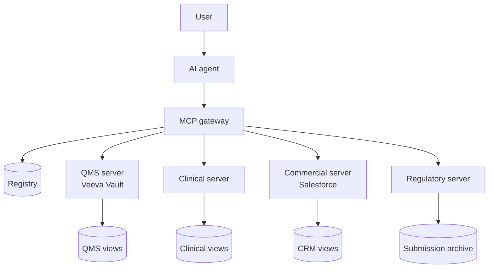
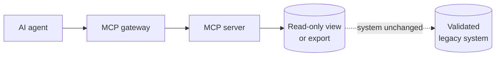

[The case for using MCP to unlock cross-functional knowledge](/blog/the-answers-are-already-inside)
in large healthcare and medtech organisations rests on a premise that is easy
to accept and hard to act on: the data already exists, the compliance work
has largely been done, and the barrier is structural rather than technical.
Accepting the premise does not tell you how to build the thing.

The architecture problem is not a greenfield one. A large medtech company
might run Veeva Vault for quality and regulatory documents, Salesforce Health
Cloud for patient and HCP data, SAP for financial and supply chain, a
clinical data warehouse, and a complaint management system — none of which
were designed to share context with each other, and several of which are
validated systems that cannot be modified without triggering revalidation.
For IT leaders in these organisations, this is the defining constraint: you
are not designing for an ideal state. You are designing for the estate
you have.

## The gateway as the enterprise control point

The MCP gateway is the only component that needs to exist before anything
else can be built. It is where user identity enters the system, where access
policy is enforced, and where every agent query is logged. In an organisation
operating under GDPR, EU MDR, and ISO 13485, the gateway is not optional
infrastructure — it is the control point that makes enterprise MCP
defensible to a regulatory auditor.

The gateway has a deliberately narrow responsibility. It knows who is asking,
which server they are trying to reach, whether their role permits that access,
and that the interaction must be recorded. It knows nothing about what a
clinical outcome record contains or what a deviation looks like in Veeva
Vault. This separation matters at scale: when access policy lives inside
individual domain servers, every role change, regulatory update, or
organisational restructure requires touching multiple systems. Centralising
policy in the gateway means the domain layer can evolve independently.

Integration with the organisation's existing identity provider — Entra ID,
Okta, or equivalent — happens at the gateway. Every downstream request
carries the authenticated user's identity. A regulatory affairs specialist
and a commercial analyst reach the same gateway but receive access to
different servers. Domain servers do not make that distinction themselves.
They trust the gateway to have already made it.

The gateway is also the organisation's single observability point for
AI-driven data access. Query volumes, error rates, access patterns by role,
and which domain servers are being reached are all visible here. For IT
leaders who will be asked — by a DPO, by an auditor, by the board — to
account for how AI systems are using internal data, this is the only place
where a coherent answer exists.

## Federated ownership at domain level

The central platform team builds and operates the gateway, the registry,
and the shared authentication infrastructure. They do not build domain
servers. That responsibility sits with the teams who own the data.

In healthcare and medtech this is not a controversial position — it follows
directly from how these organisations already operate. The quality team owns
the QMS. The regulatory affairs team owns the submission archive. The
clinical data team owns the outcomes database. Each of these functions
already has process owners: people responsible for how data is handled,
how procedures are written, and how access is controlled. Building an MCP
server is an extension of that existing mandate, not a new one.

The governance structure this implies should feel familiar. Each domain
identifies an owner responsible for what is exposed through their MCP
server: which views are built, which fields are included, what is masked,
what audit events are generated at the domain level. A data council with
cross-functional authority sits above this, approving what can be queried
across domain boundaries — a clinical data scientist accessing commercial
adoption data alongside patient outcomes, for instance, requires an explicit
decision about purpose and access that this council owns.

IT provides the platform: a standard server template, shared tooling for
authentication and logging, documentation, and a registry where servers are
published for agent discovery. Domain teams build on that foundation. They
do not own the plumbing, and IT does not own the data.

The risk of centralising domain server development in IT is a bottleneck
that stalls the entire programme. In organisations where IT is already
stretched across ERP maintenance, validated system management, and
infrastructure operations, adding MCP server development to that team
creates a queue that domain teams will eventually route around. The
federated model resolves this: central standards, distributed execution.

## The legacy and validated system pattern

Most large medtech and healthcare companies operate systems that are 15 or
20 years old and will not be replaced. Some are validated under 21 CFR Part
11 or equivalent EU requirements — modifying them triggers revalidation that
is expensive, slow, and carries real operational and regulatory risk. The
recommendation to modernise data infrastructure before implementing AI is
not wrong in principle. It describes a programme that will not finish before
the pressure to act becomes acute.

MCP does not require migration or modification. The MCP server for a legacy
or validated system sits in front of it. The underlying system is unchanged.
The server reads from whatever the system already exposes — a database view,
a read-only reporting API, a scheduled export to a staging table — and
translates that into MCP-compatible responses. The validation status of the
source system is unaffected. The compliance posture is unaffected. A new
interface now exists in front of it.

For IT leaders managing the gap between modernisation ambition and validated
system constraints, this pattern is significant. It decouples the question
of making data accessible from the question of replacing the system that
holds it. A complaint management system running on infrastructure from 2008
can still expose complaint trend data to an AI agent without becoming a
revalidation project. Both questions — access and modernisation — still need
answers eventually. They no longer need the same answer at the same time.

## Read first, then act

Enterprise MCP programmes in regulated environments should start with
read-only capability and earn the right to action over time. In medtech and
healthcare the consequences of an agent taking a wrong action — submitting
a regulatory record, triggering a CAPA workflow, routing a complaint to the
wrong queue — are not just operationally disruptive. They can have
regulatory implications. The sequencing is architectural, not cultural.

In the first phase, every server is read-only. Agents answer questions,
surface documents from Veeva, synthesise across complaint data and clinical
outcomes, explain the regulatory history of a product. The organisation
learns which questions are being asked, where the answers are wrong, and
where data quality problems sit. The audit log from the gateway makes this
visible in a way that informal usage never would. IT leaders can demonstrate
to the DPO, to quality leadership, and to the business what is being asked
and what is being returned.

Action capability — servers that write, trigger, or route — arrives in the
second phase, domain by domain, starting where the blast radius of a mistake
is smallest. A server that drafts a CAPA summary for human review is a
different risk profile from one that submits it. Each action server requires
explicit design: what operations are permitted, by which roles, with what
approval step before execution. The gateway enforces the distinction. A read
credential does not permit action.

The phased approach surfaces something no architecture review produces: an
accurate picture of the actual data landscape. When agents consistently
cannot answer a question because the relevant data sits in a system with no
MCP server, that gap appears in the registry and in the query logs. In
organisations with dozens of systems accumulated across acquisitions and
product lines, this is genuinely new information — and a more honest basis
for deciding what to build next than any system inventory produced in a
planning workshop.

What that infrastructure makes possible — for R&D, for the clinical-commercial
feedback loop, for institutional memory that outlasts the people who carry it
— is the subject of [the third piece in this series](/blog/the-organisation-that-can-hear-itself).

---

## In this series

[The answers are already inside](/blog/the-answers-are-already-inside) — why the knowledge exists and why silos prevent it from moving [Architecting MCP for healthcare and medtech](/blog/architecting-mcp-for-healthcare-and-medtech) — the gateway model, federated ownership, and phased rollout [The organisation that can hear itself](/blog/the-organisation-that-can-hear-itself) — what changes when the full picture is always present
