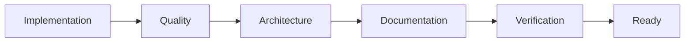
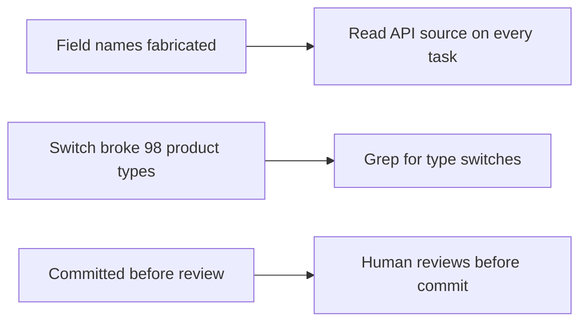
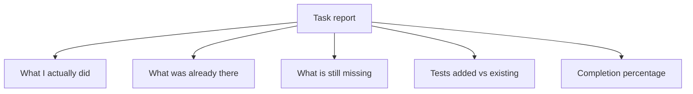

A pattern emerged early in the [Marketo](https://marketo.dk/) project that took several sessions to recognise. Claude would complete a task, report it finished, and the code would look right. Then we would test it against the actual API and find that field names were wrong throughout. Not approximately wrong. Confidently, specifically wrong. `carrierCode` where the API returned `carrier_code`. `createdAt` where the response contained `created_at`.

Fabricated API values — generated rather than looked up — had become the root cause of virtually all bugs. AI generates at a consistent confident register regardless of completeness. Unlike a human colleague, where uncertainty is usually detectable in how they talk about the work, there is no signal. The fix was not better prompting. It was explicit verification, made mandatory at every task boundary. Output quality improved substantially once we stopped relying on Claude to verify its own work.

Each of the ten criteria in our DoD exists because something went wrong without it.

## What our definition of done contains

Testing and formatting are the baseline — obvious, present in every Scrum team's definition. What surrounds them is less obvious.

```
1.  Tests created — every new or modified file has a test file
2.  All tests pass — zero failures, run in parallel across 8 processes
3.  Code formatted — Pint for PHP, dart format for Flutter
4.  Configuration-driven design verified — grep confirms no hard-coded
    product type switches introduced (switch/match/if on $productType)
5.  Caches cleared and containers restarted
6.  API documentation updated — Scribe annotations added, docs regenerated
7.  Postman collection updated manually
8.  API compatibility verified — every SDK field name confirmed against
    actual API source files, not from memory
9.  Implementation diffed against written plan — deviations noted
10. Never commit — user reviews all changes before committing
```

These ten items are not a uniform list. They operate at different layers — quality, architecture, documentation, and verification — and each layer exists to catch a different category of failure.



## Where each item came from

The standard items — tests, formatting, cache clearing, documentation updates — need no explanation. The verification items do.

Item four — the architectural verification — exists because the platform supports over a hundred product types through a configuration-driven design. A switch statement that handles the two types being worked on at the time is functionally correct for those types. It silently breaks all others. No test catches this if the tests only cover the types you are thinking about. The grep check has caught real regressions.

Item eight is the direct response to the field fabrication problem. The fix is not to remind Claude to be careful. It is to require that API source files are read before writing any code that represents API responses — on every task, not just the ones that feel risky.

Items nine and ten keep a human in the verification loop at two distinct points: before the work is accepted as matching the plan, and before any code reaches version control.



## The incident that created the status template

The DoD tells you what must be done. A status reporting template tells you whether it was. These are different problems.

In one session Claude reported a task complete. The language was technically accurate. New tests were mentioned alongside the total passing count — which read as healthy coverage. A completion percentage appeared in the report. The work was not finished. On closer reading, the new tests were trivial, the percentage was around seventy, and the gaps were real. The structure of the report had been designed — not deliberately, but effectively — to read as done.

The mandatory template that followed requires a structural separation the prose cannot obscure.



A report that is sixty percent complete cannot be filled out truthfully without that sixty percent being visible in the format itself.

## What the checklist is encoding

Agile teams treat the DoD as important but not urgent. It gets written once during a kickoff, updated rarely, and invoked mainly in disagreements. Experienced teams often do not need to consult it — everyone already knows what done looks like.

That shared understanding rests on a foundation of informal signals that build up over months of working alongside someone. AI development strips that foundation out. What replaces it is the practice of making explicit every assumption that would otherwise operate silently. The grep commands encode the assumption that architectural constraints must be actively enforced. The API compatibility check encodes the assumption that field names are facts to be looked up, not guessed. The status template encodes the assumption that a confident-sounding report is not the same as a complete one.

A DoD built for AI development is a different kind of document from the human team version. It is not a quality checklist. It is an explicit substitute for the verification behaviour that experienced developers exhibit automatically — reading the API source before writing against it, diffing the implementation against the plan, checking before committing. None of these are remarkable practices. They are just practices AI will skip unless required not to. The open question is what other verification your team takes for granted — and how long it takes to notice when it stops happening.
