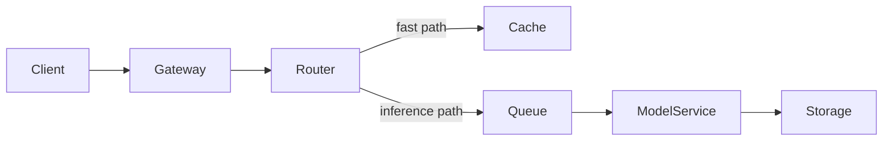

When organisations talk about AI adoption, the conversation usually focuses on applications: a chatbot here, a summarisation tool there, a co-pilot bolted onto an existing product. That is the visible layer. But underneath it, something more consequential is happening. The infrastructure assumptions that have governed enterprise platform design for the last decade are being rewritten.

This is not a story about AI replacing jobs or unlocking productivity gains in individual workflows. It is a story about load, latency, data gravity, and the operational model of platform teams.

## The inference problem is an infrastructure problem

Running AI models at enterprise scale is fundamentally different from running traditional workloads. A conventional API request is stateless, fast, and cheap. An inference request is none of those things — it is compute-intensive, potentially long-running, and produces outputs whose quality depends on context window management, prompt engineering, and model versioning.

Enterprise platforms designed for REST APIs and relational databases were not built for this. The call-response model breaks down when responses take seconds rather than milliseconds. Connection pools, timeout configurations, circuit breakers, and SLA definitions all need rethinking.

The organisations handling this well are not treating AI inference as an application concern. They are elevating it to a platform capability — building shared inference infrastructure with its own capacity planning, its own observability stack, and its own cost model.

## Data gravity shifts the design centre

Traditional platform architecture is organised around compute proximity to data. You put your services close to your databases, you manage replication carefully, you design around read/write patterns.

AI changes this in a subtle but important way. The most valuable asset for an AI-enabled organisation is not raw data — it is *prepared* data. Labelled, cleaned, embedded, and indexed for retrieval. The preparation pipeline becomes as architecturally important as the data store itself.

This creates a new kind of data gravity. The embedding index becomes a first-class infrastructure component, not a cache or a search sidecar. Vector databases, retrieval pipelines, and the metadata schemas that make retrieval useful are being promoted into the platform layer.

## The operational model of platform teams is changing

Platform teams in large organisations have historically operated on a slow release cadence. Infrastructure changes are validated rigorously, rolled out carefully, and supported for years. The cognitive overhead is managed by keeping the surface area small.

AI platforms break this pattern. Model updates arrive frequently. Prompt strategies change. Evaluation frameworks for model outputs are still immature. The platform team now owns components that change at the pace of an application layer, not an infrastructure layer.

The organisations navigating this successfully are treating their AI platform as a product, not an internal service. They have product managers, roadmaps, and user research. They are measuring adoption and developer experience, not just uptime.

## What comes next

The platforms being built today for AI workloads will become the default enterprise infrastructure within five years. The organisations investing in this now — building shared inference capacity, treating retrieval as a platform primitive, and professionalising their internal AI platform teams — are acquiring capabilities that will be very difficult to replicate later from a standing start.

The AI application layer is commoditising fast. The platform layer is where durable competitive advantage will be established.
