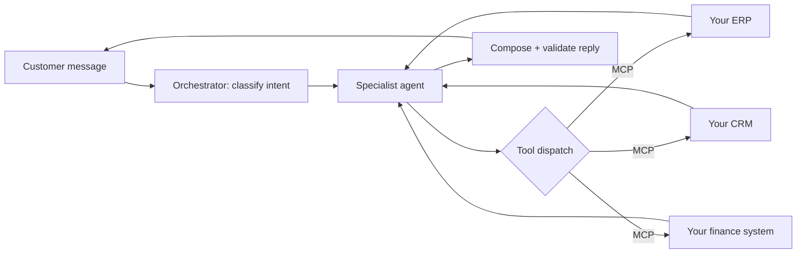
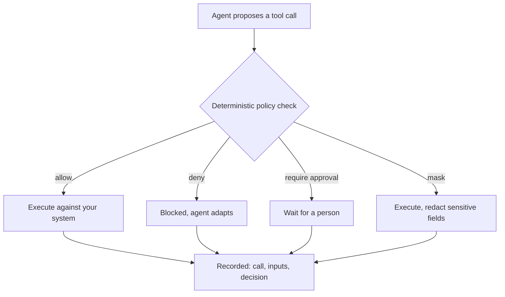

When you set out to build AI for customer operations, the product wants to take an obvious shape. A customer asks where their order is, or whether they can still return something, or what a replacement part would cost. To answer, the software needs to know what an order is, what your return policy says, how your pricing works. So you model it. You build an order object, a returns workflow, a pricing rule engine, and you import the customer's data to feed them. Within a year you are running a second system of record alongside the customer's ERP, and the two of them have started, quietly, to disagree about reality.

This is the default architecture of the category, and it is a trap. The platform team ends up rebuilding the customer's business inside the platform — slower than the original, perpetually out of sync with it, and unable to answer any question nobody thought to model in advance. The integration debt compounds. The customer is now locked in, because their operational logic has been copied into someone else's schema. And the thing they actually wanted — correct answers drawn from their real systems — is the one thing the architecture makes hardest.

[oHallo](https://ohallo.ai), which we are launching today, is built on the opposite decision. The most important choices in it are not things it does. They are things it refuses to do.

## The first refusal: model nothing

oHallo's founding constraint is a single sentence: the platform never models business logic. Pricing, ordering, returns, quoting — none of it lives in the platform. It lives where it already lives, in the customer's ERP, CRM, finance and logistics systems, and oHallo reaches it through the Model Context Protocol.

So when a customer asks whether they can return an order, the platform does not consult its own idea of your return policy, because it has none. It works out what the customer wants, decides which of *your* systems can answer, calls the relevant tool, and composes a reply from what comes back. The return window, the eligibility rules, the refund amount — these are facts in your system, looked up at the moment they are needed, not a copy maintained in ours.

This sounds like a constraint that costs you capability. It is the reverse. Because the platform models nothing, it stays thin and stays general. A new capability does not require us to ship code — it requires the customer to connect a system. The source of truth never leaves the systems that already own it, so nothing drifts out of sync. And because the integrations are MCP servers the customer runs on their own infrastructure, against an open standard the whole industry is converging on, there is nothing to be locked into. The platform is a dispatch and orchestration layer. It is deliberately not a place your business lives.

## The second refusal: the model does not decide what it is allowed to do

The other great temptation in agentic software is to make safety a matter of the model's judgment. Write a careful prompt, tell the agent what it must never do, and trust it to comply. This works until the day an instruction buried in an inbound email persuades the model otherwise, and then it fails in exactly the situations you built it to survive.

oHallo refuses this too. Every action an agent wants to take — every call into one of your systems — passes through a checkpoint before it runs. Deterministic code, not a prompt, returns one of four verdicts: allow, deny, require a human's approval, or mask the result before the agent sees it. The principle the platform is built on is blunt: the model proposes actions; code decides whether those actions are permitted. The agent cannot argue with it.

This is where your policies live: the approval threshold on a refund above a certain value, the rule that a return needs an order number before anything proceeds, the set of systems a given market is allowed to touch. They are written down once, ahead of time, and enforced on every conversation by code that runs in a fraction of a millisecond. An adversarial message can make the model *want* to do something it should not. It cannot make the gate say yes. The agent is never the thing standing between a customer and your money — a deterministic rule you configured is.

There is a second benefit, quieter but decisive for the kind of company this is built for. Every call, every input, every policy decision and every human intervention is recorded as it happens. The audit trail is not a feature bolted on for compliance; it is a by-product of how the work is done. For a regulated buyer who has to demonstrate record-keeping and human oversight rather than assert it, that distinction is the whole conversation.

## Humans on the loop, not in it

Because governance is set ahead of time and enforced deterministically, a person does not have to approve each action as it happens. The team configures the rules once and then supervises. Conversations are handled autonomously; what reaches a person is the exception — the question the platform cannot answer with confidence, the customer who would rather speak to someone, the action weighty enough that you asked to keep the last word. These arrive as a queue your team works through in its own time, not a phone that will not stop ringing.

Two gates are kept deliberately, and only two. A high-value or destructive action waits for a person to approve it. And anything the platform proposes to *learn* — a new answer for the knowledge base, a change to one of your rules, drafted from how your team handled something the platform could not — waits for someone to agree before it changes how every future customer is answered. Everything else runs. The work of watching the platform is, quietly, also the work of teaching it, and the things that still need a person grow fewer over time.

## Why this, and why now

This is built for a specific company that the market has managed to skip. Mid-market B2B — manufacturers, distributors, wholesalers — whose customers mostly write in to ask where an order is, what an invoice covers, when something will ship. The answers to those questions are not in a help-centre article; they are in an ERP. These companies are too large to run on a shared inbox and too small to absorb a six-figure contact-centre deployment, and the tools above and below them are built either for software companies with no ERP or for enterprises with a year to integrate. Their support teams spend most of the day looking things up in internal systems and pasting the result into an email by hand.

That lookup work — read the intent, query the right system, compose the answer, enforce the rule — is precisely what a dispatch layer can do, and it is most of the job. Two things make it practical now rather than five years ago. The Model Context Protocol has gone from a proposal to a standard, which is what turns "call the customer's own systems" into a default instead of a bespoke project per integration. And the frontier models are finally good enough at the reading-and-routing part to be trusted with it — provided, and this is the whole point, they are not trusted with the part where it matters whether an action is allowed. All of it runs in the EU.

The line on the site is "the first time it happens you don't quite believe it." It describes a specific moment: a request that would have sat in a queue for half a day resolves itself, correctly, against your live systems, while you are still reading the notification. The interesting engineering behind that moment is not what the platform does. It is the two things it was disciplined enough not to do — model your business, and let the model decide what it is allowed to do. The boundary is the product. oHallo is live at [ohallo.ai](https://ohallo.ai).
