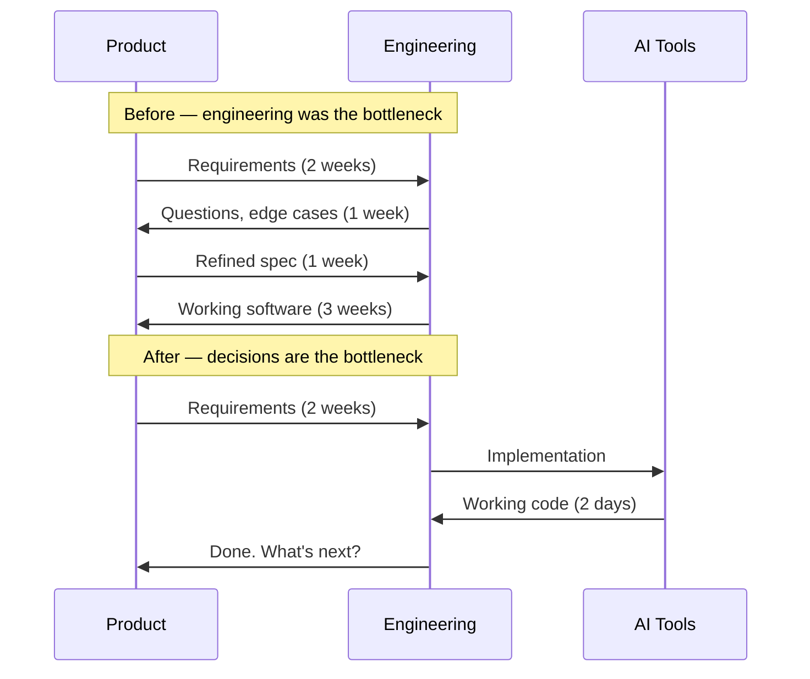
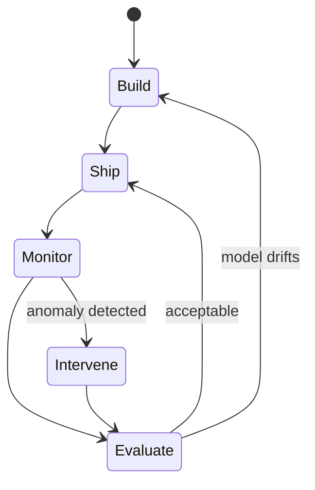

Software product development has operated on a familiar cadence for twenty years. You define requirements, design solutions, write code, test, ship, and measure. The cycle repeats. The rhythm is quarterly at the strategy level, weekly at the team level, daily at the individual level. Tooling has changed enormously — agile, DevOps, continuous delivery — but the underlying tempo has been relatively stable.

AI is changing the tempo.

## The code generation gap

The most immediate change is in the speed of implementation. A competent engineer using AI-assisted development can produce working code at two to five times the rate they could two years ago. This is not a marginal improvement. It compresses the implementation phase of the product development cycle in ways that expose every other bottleneck.

When code is not the bottleneck, decision-making becomes the bottleneck. Product managers who are used to having weeks to refine requirements while engineering catches up are now finding that engineering is waiting for them. The assumption that "we will figure it out during development" no longer holds when development takes days instead of weeks.

The teams handling this well are front-loading the thinking. More time on problem definition, user research, and outcome specification before a line of code is written — and then moving very fast once direction is clear.

## Quality is harder to define

Traditional software quality has well-established measures. Correctness is binary: the code either does what it should or it does not. Coverage can be quantified. Performance has objective benchmarks. Defect rates are trackable.

AI-generated artefacts — whether code, content, recommendations, or decisions — do not fit cleanly into this model. Quality is probabilistic and context-dependent. The output might be correct ninety percent of the time but subtly wrong in edge cases that are difficult to specify in advance.

This is not a reason to avoid AI in products. It is a reason to invest heavily in evaluation infrastructure — the tooling, processes, and expertise needed to measure whether AI outputs are good enough for their purpose. The organisations that are building this capability now will have a significant advantage when AI capabilities are democratised further.

## The definition of done is shifting

A product is traditionally "done" when it behaves as specified. AI-native products introduce a new relationship with done: the product's behaviour will change over time as the underlying models are updated, the training data evolves, or the usage patterns shift the system in unexpected directions.

This has profound implications for how product teams think about maintenance. It is no longer sufficient to ship and move on. AI products require continuous monitoring, evaluation, and intervention — more like operating a service than shipping a product.

Some teams are responding by treating their AI models as infrastructure, with a dedicated operational practice analogous to database administration. This is probably the right instinct. The model layer is increasingly where the business logic lives, and it needs to be operated with the same rigour as the rest of the stack.

## The people question

The most underrated implication of all this is what it does to team composition. Product development has been organised around specialisation for so long that it is easy to forget how recently that specialisation was established.

AI tools are eroding some specialisation boundaries while deepening others. The junior engineer writing boilerplate is being displaced. The senior engineer who can direct AI tools with precision and evaluate their output critically is becoming more valuable. The product manager who can specify desired outcomes rather than implementation details is in higher demand.

The teams that are thriving are the ones that have not just adopted AI tools, but have redesigned their practices around what those tools make possible and what they cannot yet do. That is a harder change than installing a code assistant — but it is the one that matters.
