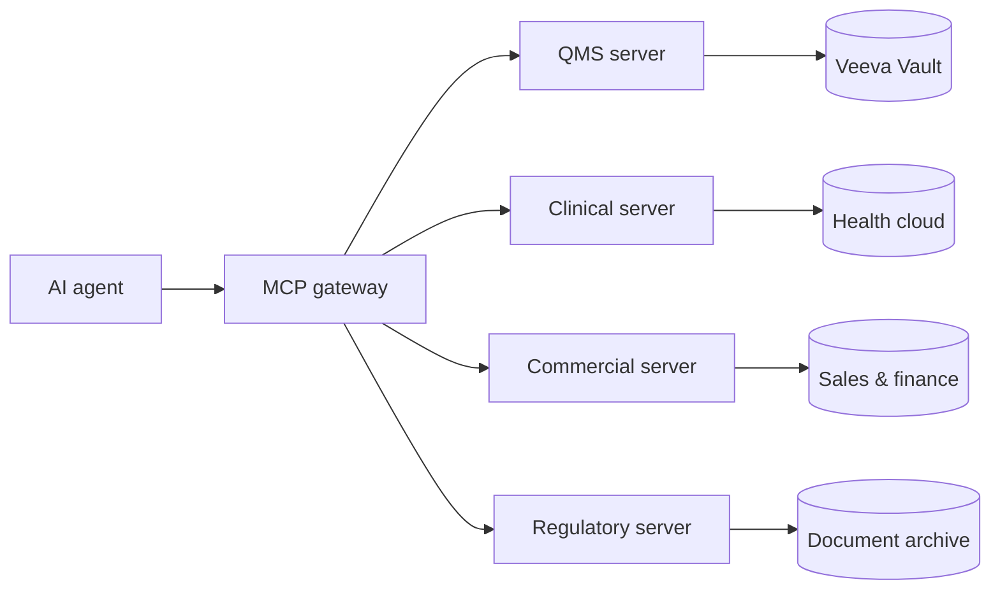
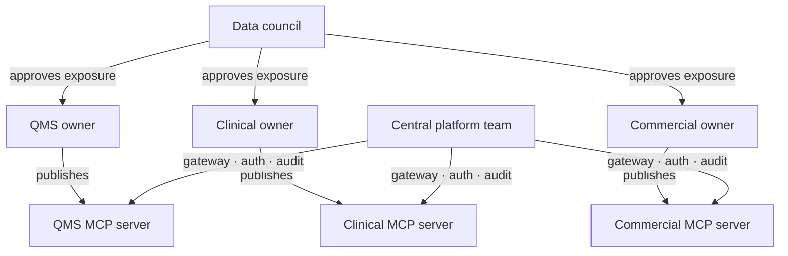

Every large organisation contains the answer to most of the hard questions it is struggling with. The pricing signal that would explain sluggish adoption in a new market. The clinical outcome data that would reframe a product strategy. The complaint pattern that is a leading indicator of a quality problem. None of this is hidden. It exists, somewhere in the organisation's systems, waiting to be read.

The problem is that it cannot be read — not in any practical sense. It lives in a sales database, a clinical data warehouse, a quality management system, a document archive. The people who know pieces of it are in separate teams, measured on separate targets, accountable to separate leadership chains. In a large medtech or healthcare company, this fragmentation is not a failure. It is how the organisation was designed.

MCP changes the economics of the question. Not the data. Not the people. The cost of asking.

## What MCP actually does

The Model Context Protocol is a standardised interface that allows AI agents to query external data sources at inference time. Instead of training a model on internal data or manually feeding it documents, you expose your systems through MCP servers — lightweight interface layers that the agent queries when it needs context to answer a question.

In a medtech company, this looks like a set of domain-specific servers: one for the quality management system, one for clinical data, one for commercial performance, one for the regulatory document archive. The agent does not get direct database access. It queries views — purpose-limited, role-appropriate extracts of data that were designed with compliance in mind before MCP was part of the picture.

This distinction matters. The compliance work has already been done by the teams who designed those views. MCP does not reopen that question. It builds a door in front of work that already exists.

Legacy systems are not the blocker many assume. Healthcare and medtech companies operate systems that are 15 or 20 years old — validated, stable, and untouchable for good reasons. MCP does not require migration. You build the interface layer in front of the system. The underlying data store stays exactly as it is. For organisations that have lived through painful system migrations, this matters.

## The silo problem is not a compliance problem

The standard narrative about healthcare and AI attributes the gap to regulation. The compliance burden is real — GDPR, EU MDR, national health data authorities, validated system requirements. These are not obstacles invented by cautious lawyers. They are legitimate frameworks protecting real interests.

But they are not the reason data cannot move across functional boundaries inside a single organisation. That reason is structural. Sales owns its data. Clinical owns its data. Finance owns its data. The ownership is functional, not legal. The barrier is organisational design, not regulation.

In every large company there are people who know pieces of a picture that, assembled, would change the decision being made at the top. The clinical team knows that a product's outcomes data is weaker than expected. The commercial team knows the price point is wrong for the market. The regulatory team knows there is a competitor shift that will matter in 12 months. Each piece is acted on within its silo. The assembled picture belongs to no one.

## The democratisation decision

Making MCP useful requires a prior decision: to treat data as an organisational asset rather than a functional one. This is not a technology decision. It is a structural one, and it is harder.

Every domain that exposes an MCP server is, in effect, agreeing that other parts of the organisation can ask questions of its data. That changes relationships. A commercial team's pricing decisions become queryable alongside clinical outcome trends. A quality team's complaint patterns become visible next to product adoption data. The conversations this produces are not always comfortable.

The organisations that will gain most are the ones that design for this explicitly. Each domain needs someone who owns not just how data is handled internally, but how it is exposed outward — what view is built, what fields are included, what is audited. This is an extension of the process owner model that regulated industries already understand well. The role exists in embryonic form. It needs a wider mandate.

The central IT or platform team provides the shared infrastructure — the gateway, authentication, audit logging. They set the technical standards. They do not build the domain servers. That work belongs to the people who understand the data.

## What leadership actually needs to do

The instinct in large organisations is to make AI a C-suite initiative. A steering committee forms, a strategy is written, a roadmap is produced. This is usually the wrong structure for the wrong reasons.

The people who understand what questions cannot currently be asked are not in the boardroom. They are the data analyst who spends two weeks every quarter assembling a report from systems that do not speak to each other. The regulatory specialist who knows the answer to a question exists somewhere in the document archive but cannot surface it before the meeting. The clinical data scientist whose outcomes analysis is incomplete because the commercial adoption data sits behind a boundary they cannot cross.

These people will drive MCP adoption if given infrastructure and permission. Leadership's job is to create those conditions — funding the shared platform, establishing a data council with enough authority to make cross-domain access decisions, and redesigning what it means to own a domain so that exposure is rewarded rather than guarded.

The harder shift is accepting that the organisational boundary between functions — the line that has governed information flow for decades — needs to move. Not dissolve. Move. Responsibilities need to widen beyond the silo. More people need to know more. The performance incentives, the role definitions, the governance model — all of it needs to reflect an organisation where knowledge is expected to flow rather than pool.

What changes when it does is not just the quality of individual decisions. It is who gets to have the conversation that leads to a decision in the first place. Information asymmetry inside organisations is not accidental. It is structural, and it concentrates influence. Democratising data access redistributes that influence — which is why this is a leadership problem, not a technology problem, and why the technology alone will not be enough.

The architecture that enables this — the gateway model, federated ownership, and the phased rollout that regulated organisations need — is covered in [a companion piece](/blog/architecting-mcp-for-healthcare-and-medtech).

---

## In this series

[The answers are already inside](/blog/the-answers-are-already-inside) · [Architecting MCP for healthcare and medtech](/blog/architecting-mcp-for-healthcare-and-medtech) · [The organisation that can hear itself](/blog/the-organisation-that-can-hear-itself)
