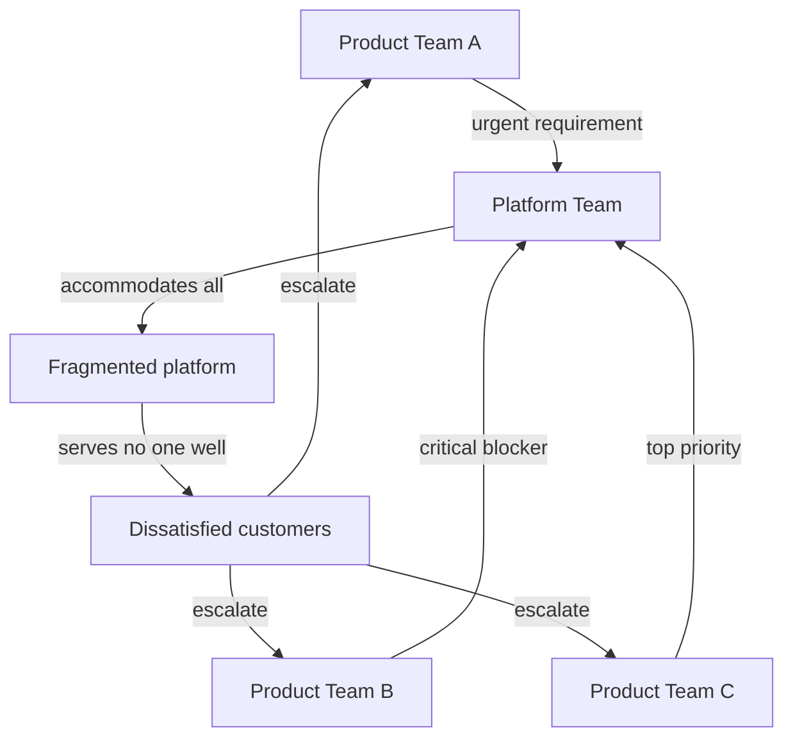

There is a particular kind of organisational failure that afflicts large technology companies with some regularity. It usually begins with a genuine insight: there are common problems across product teams, duplicated effort is wasteful, and a shared platform would solve both. The internal platform team is formed. Engineers are hired. A roadmap is drawn up. The work begins.

Three years later, the platform has comprehensive documentation and a roadmap that stretches to the horizon. It has also, somehow, managed to be the source of more complaints than any other team in the organisation. Product teams are building workarounds. Senior engineers who joined to work on "real products" are quietly updating their CVs. The platform team is in a perpetual state of explaining itself.

This is the platform paradox: the imperative to serve everyone produces a platform that serves no one particularly well.

## Why it happens

The mechanism is straightforward. Platform teams exist to serve internal customers — the product teams that build on their infrastructure. Internal customers, unlike external ones, have access to the platform team and are not shy about using it. Every product team arrives with its own requirements, its own urgency, and its own conviction that its use case is the general case.

A platform team without a strong product function will try to accommodate all of these inputs. The result is a surface area that grows faster than the team's capacity to maintain it, a roadmap that is effectively determined by whoever complained most recently, and an abstraction layer that has been bent in so many directions that it no longer abstracts anything coherently.

The second mechanism is the absence of external pressure. Product teams face market feedback — their products either work for users or they do not. Platform teams face only internal feedback, which is structurally different. Internal customers cannot easily switch providers. They cannot vote with their wallets. Their only recourse is escalation, workaround, or complaint — all of which produce noise without producing clarity about what is actually valuable.

## The product discipline gap

The platform teams that escape this trap share a common characteristic: they have a genuine product discipline. Not just a product manager in title, but a real practice of user research, outcome definition, and ruthless prioritisation.

This means understanding the jobs to be done by platform consumers — not the features they are asking for, but the underlying problems they are trying to solve. It means maintaining a product strategy that explains what the platform will *not* do, not just what it will. It means building relationships with platform consumers that are honest enough to surface the real problems rather than the politically safe ones.

Most importantly, it means having the organisational authority to say no. Platform teams without this authority cannot have a product strategy — they can only have a feature list.

## The golden path

One technique that works well is the *golden path* — an opinionated, end-to-end approach to solving a common problem that the platform team supports fully and optimises relentlessly.

The golden path is explicitly not the only way to do things. Teams with unusual requirements are free to deviate. But deviation means accepting reduced support, less tooling, and the operational overhead of divergence. The golden path is made deliberately attractive by investing in its quality, documentation, and first-class tooling.

This is a fundamentally different posture from "we support whatever you need." It concentrates platform investment where it produces the most impact, reduces the cognitive overhead of decision-making for product teams, and gives the platform team something concrete to optimise for.

## What this requires from leadership

None of this works without organisational support. Platform teams cannot adopt a product discipline if their leadership measures them by the number of features shipped or the number of requests fulfilled. They cannot maintain a golden path strategy if escalations routinely override their prioritisation.

The leaders who build excellent platform organisations are the ones who understand that the platform's job is not to serve every request — it is to raise the capability ceiling of the entire engineering organisation. That is a different mandate, and it requires a different kind of accountability.
