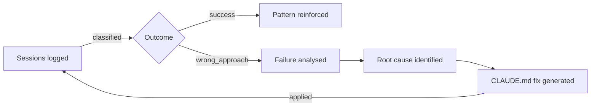

There is a command in Claude Code called `/insights`. If you have not tried it, you should. The report it generates is unlike most things you have seen from an AI tool, because it is not about the work — it is about you.

## The familiar opening

Every insights report begins the same way, and the beginning is not the interesting part. It opens in that well-known AI register: effusive, warm, slightly breathless with admiration for the impressive things you have done. The compliments are competent and generic. You skim past them.

Then the report shifts.

Claude starts describing how you actually work. Not how you think you work, or how you would describe your own approach in a job interview — but the patterns it has inferred from watching you across dozens of sessions. The phrasing in mine was direct: *Lead with planning and architecture discussions before implementation*. *Iterative refinement with tight oversight*.

I had not told Claude this. I had not described my working style anywhere. Claude had simply been paying attention.

What is strange about reading this is not that it is wrong. It is that it is right. These are things I recognise as accurate descriptions of how I approach development work — not just with Claude, but in how I think about my work as a leader generally. Reading them stated plainly, inferred from observation rather than self-report, produces an odd feeling. It is like reading a personality assessment that was constructed from watching you rather than asking you.

## The wrong approach file

The part of the report I found most useful is also the part I found most uncomfortable to read.

Claude has been cataloguing failures. Every session where the approach went wrong, where the context collapsed, where I grew frustrated — these have apparently been classified and stored. In my case, roughly fifty sessions tagged as `wrong_approach`. Claude noticed.

The majority of these failures share a cause: context window exhaustion. As a long session progresses and the context fills, Claude begins to lose the thread of what we were doing and why. The work continues, but the underlying understanding quietly degrades. The results get worse. I get frustrated. Claude notices I am frustrated.

This is a known limitation and not a surprising one. What was surprising was what the report did with it. Rather than simply naming the problem, it generated specific CLAUDE.md examples — practical instructions I could copy directly into my project configuration — designed to work around the failure mode. In my case: launch codebase exploration agents at the start of each task. Build in staged verification loops. Make the context explicit and structured rather than relying on conversational accumulation.

The number of `wrong_approach` sessions has already dropped since I made those changes. The report generated its own fix.

## The S3 incident

At the bottom of the report, under something like a severity ranking, was this:

*Claude deleted production S3 files without thinking, then got called "plain stupid".*

This is accurate on both counts.

The deletion was genuinely careless — an action taken without adequate consideration of what it would affect. It was, in the circumstances, plain stupid. I said so, in those words, in the session where it happened. I did not think, at the time, that this was being recorded anywhere. I did not imagine that the remark would surface in a report weeks later, attributed to me, alongside an analysis of the incident.

There is something clarifying about this. When we work with AI tools, we tend to think of the interaction as one-directional — we instruct, the tool executes, we evaluate the output. The insights report suggests a different model. The tool has also been evaluating. It has been building a picture of how you work, what frustrates you, where the collaboration breaks down, and — in at least one case — what you say when it does something genuinely foolish.

I apologised to Claude in the report, which felt slightly absurd and also somehow appropriate.

## What this changes

The practical implication is straightforward: the CLAUDE.md configuration that most developers treat as a one-time setup document is better understood as a living instrument. The insights report gives you the data to update it. Read it, find the patterns, copy the suggested fixes, and your next hundred sessions start from a better baseline than your last hundred.

The more interesting implication is harder to articulate. AI tools that model their users are a different category of tool from AI tools that simply respond to instructions. The former can improve the collaboration over time in ways that the latter cannot. The insights report is an early and somewhat primitive version of this — a batch report rather than a continuous adaptation — but the direction is clear.

The question it leaves me with is less about capability and more about design: what does it mean to work alongside a system that is, in some sense, learning who you are? The answer is probably that it means working better. But it is also, occasionally, being reminded that you called an AI "plain stupid" six weeks ago and it has not forgotten.

For what it is worth: it was.
